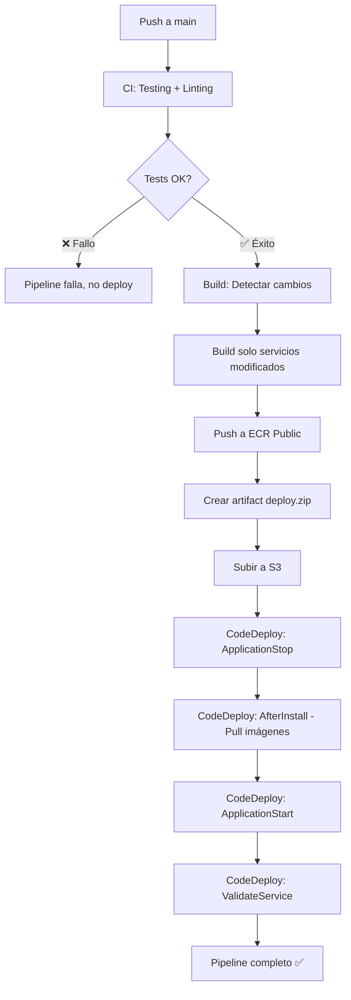
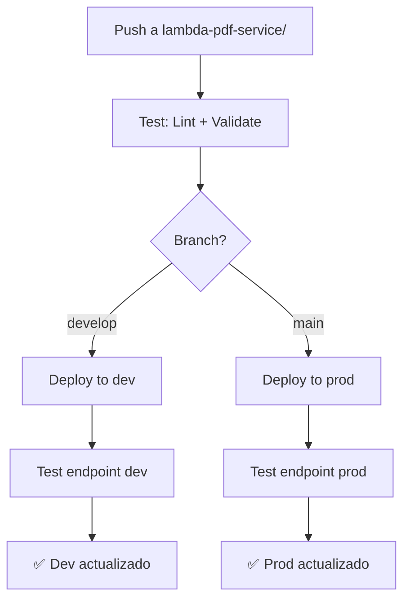

# 📋 Documentación Pipeline CI/CD - Grupo 6

## 🎯 Descripción General

El proyecto utiliza **GitHub Actions** como plataforma de CI/CD, con tres pipelines principales que automatizan testing, construcción, despliegue y entrega continua de los servicios en AWS.

---

## 🔄 Pipeline 1: CI - Integración Continua (`ci.yml`)

### **Propósito**
Ejecutar pruebas automáticas y validar la calidad del código Python en cada push o pull request.

### **Trigger (Cuándo se ejecuta)**
```yaml
on:
  push:
    branches: [ "main" ]
    paths-ignore: ['README.md', 'docs/**', 'scripts/local/**']
  pull_request:
    branches: [ "main" ]
```
- ✅ Se ejecuta en cada push a `main`
- ✅ Se ejecuta en cada pull request hacia `main`
- ❌ Se **ignora** si solo cambian archivos de documentación

---

### **Job 1: `build` - Testing y Linting**

#### **Pasos Ejecutados:**

1. **Checkout del código**
   ```yaml
   - uses: actions/checkout@v4
   ```
   - Descarga el código fuente del repositorio

2. **Configuración de Python 3.11**
   ```yaml
   - uses: actions/setup-python@v3
     with:
       python-version: "3.11"
   ```
   - Instala Python 3.11 en el runner de Ubuntu

3. **Levanta PostgreSQL para tests**
   ```yaml
   services:
     postgres:
       image: postgres:13
       env:
         POSTGRES_DB: testdb
         POSTGRES_USER: testuser
         POSTGRES_PASSWORD: testpass
       ports: [5432:5432]
   ```
   - Crea una base de datos temporal para pruebas de integración
   - Health check automático cada 10 segundos

4. **Instalación de dependencias**
   ```bash
   python -m pip install --upgrade pip
   python -m pip install flake8 pytest
   pip install -r requirements.txt
   ```
   - Instala herramientas de testing (`pytest`) y linting (`flake8`)
   - Instala todas las dependencias del proyecto

5. **Linting con Flake8**
   ```bash
   # Paso 1: Errores críticos (syntax errors, undefined names)
   flake8 . --count --select=E9,F63,F7,F82 --show-source --statistics
   
   # Paso 2: Warnings (no bloquea el build)
   flake8 . --count --exit-zero --max-complexity=10 --max-line-length=127
   ```
   - **E9**: Errores de sintaxis de Python
   - **F63, F7, F82**: Variables no definidas, imports sin usar
   - Complejidad ciclomática máxima: 10
   - Largo máximo de línea: 127 caracteres

6. **Ejecución de tests con pytest**
   ```bash
   pytest || echo "No tests found"
   ```
   - Ejecuta todos los tests unitarios e integración
   - Se conecta a la DB PostgreSQL temporal
   - Si no hay tests, continúa (no falla el pipeline)

---

### **Job 2: `run-automation` - Script de Automatización**

#### **Pasos Ejecutados:**

1. **Checkout del código**
2. **Dar permisos de ejecución**
   ```bash
   chmod +x ./scripts/automation.sh
   ```
3. **Ejecutar script de automatización**
   ```bash
   ./scripts/automation.sh
   ```
   - Actualmente ejecuta tareas automatizadas definidas en `scripts/automation.sh`

---

## 🐳 Pipeline 2: Build and Push - Construcción de Imágenes Docker (`build-and-push.yml`)

### **Propósito**
Construir imágenes Docker y desplegarlas en AWS ECR cuando hay cambios en los servicios backend.

### **Trigger (Cuándo se ejecuta)**
```yaml
on:
  push:
    branches: [main]
    paths:
      - 'api/**'
      - 'mqtt_listener/**'
      - 'jobmaster/**'
      - '.github/workflows/build-and-push.yml'
      - 'docker-compose.production.yml'
      - 'docker-compose.workers.yml'
```
- Solo se ejecuta cuando cambian archivos de los servicios backend
- **No** se ejecuta si solo cambia documentación o frontend

---

### **Job 1: `build-and-push` - Construcción Multi-Servicio**

#### **Estrategia Matrix:**
Construye 5 servicios en paralelo:
- `api` (FastAPI backend)
- `mqtt_listener` (Consumidor de mensajes MQTT)
- `jobmaster` (Orquestador de jobs Celery)
- `worker` (Workers Celery para tareas asíncronas)
- `flower` (Monitoreo de Celery)

#### **Pasos Ejecutados:**

1. **Checkout del código**

2. **Detección de cambios inteligente**
   ```yaml
   - uses: dorny/paths-filter@v3
     with:
       filters: |
         api: ['api/**']
         mqtt_listener: ['mqtt_listener/**']
         jobmaster: ['jobmaster/**']
   ```
   - Solo construye las imágenes de servicios que **realmente cambiaron**
   - Optimiza tiempo y recursos del pipeline

3. **Autenticación en AWS**
   ```yaml
   - uses: aws-actions/configure-aws-credentials@v4
     with:
       aws-access-key-id: ${{ secrets.AWS_ACCESS_KEY_ID0 }}
       aws-secret-access-key: ${{ secrets.AWS_SECRET_ACCESS_KEY0 }}
       aws-region: us-east-1
   ```
   - Se autentica usando credenciales almacenadas en GitHub Secrets
   - Región: `us-east-1`

4. **Login en Amazon ECR Public**
   ```yaml
   - uses: aws-actions/amazon-ecr-login@v2
     with:
       registry-type: public
   ```
   - Se conecta al registro público de contenedores de AWS
   - Registry Alias: `i9t5a7b1`

5. **Build, Tag y Push de imágenes**
   ```bash
   # Para cada servicio que cambió:
   docker build -t $REGISTRY/$REGISTRY_ALIAS/$REPOSITORY:$IMAGE_TAG ./path
   docker tag $REGISTRY/$REGISTRY_ALIAS/$REPOSITORY:$IMAGE_TAG $REGISTRY/$REGISTRY_ALIAS/$REPOSITORY:latest
   docker push $REGISTRY/$REGISTRY_ALIAS/$REPOSITORY:$IMAGE_TAG
   docker push $REGISTRY/$REGISTRY_ALIAS/$REPOSITORY:latest
   ```
   - **Tag 1**: SHA del commit (ej: `abc123def456`)
   - **Tag 2**: `latest` (siempre apunta a la última versión)
   - Sube ambos tags a ECR Public

**Ejemplo de imágenes generadas:**
```
public.ecr.aws/i9t5a7b1/g6_arquisis/api:abc123def456
public.ecr.aws/i9t5a7b1/g6_arquisis/api:latest
public.ecr.aws/i9t5a7b1/g6_arquisis/worker:abc123def456
public.ecr.aws/i9t5a7b1/g6_arquisis/worker:latest
```

---

### **Job 2: `deploy-to-ec2` - Despliegue Continuo con AWS CodeDeploy**

**Dependencia:** Solo se ejecuta si `build-and-push` fue exitoso.

#### **Pasos Ejecutados:**

1. **Checkout del código**

2. **Autenticación en AWS**

3. **Login en ECR** (para que EC2 pueda descargar imágenes)

4. **Crear artifact de deployment**
   ```bash
   zip -r deploy.zip appspec.yml docker-compose.production.yml \
     ./scripts/application-stop.sh \
     ./scripts/after-install.sh \
     ./scripts/application-start.sh \
     ./scripts/validate-service.sh
   ```
   - Empaqueta configuración de CodeDeploy (`appspec.yml`)
   - Incluye Docker Compose de producción
   - Incluye scripts de lifecycle hooks

5. **Subir artifact a S3**
   ```bash
   aws s3 cp deploy.zip s3://g6arquisisbucket/deploy.zip
   ```
   - Sube el paquete al bucket S3 configurado

6. **Crear deployment en CodeDeploy**
   ```bash
   aws deploy create-deployment \
     --application-name g6_arquisis-CDApp \
     --deployment-group-name g6-CDeploymentgroup \
     --s3-location bucket=g6arquisisbucket,key=deploy.zip,bundleType=zip \
     --description "Automatic deployment from GitHubActions commit $SHA"
   ```
   - Inicia el proceso de despliegue automatizado
   - CodeDeploy descarga el zip desde S3
   - Ejecuta los lifecycle hooks en la instancia EC2

7. **Esperar confirmación de éxito**
   ```bash
   aws deploy wait deployment-successful --deployment-id $DEPLOYMENT_ID
   ```
   - Espera hasta que CodeDeploy confirme deployment exitoso
   - Si falla, el pipeline marca error

---

## 📦 AWS CodeDeploy - Lifecycle Hooks (`appspec.yml`)

### **Archivo de Especificación**
```yaml
version: 0.0
os: linux
files:
  - source: ./docker-compose.production.yml
    destination: /home/ubuntu/g6_arquisis_back
  - source: scripts
    destination: /home/ubuntu/g6_arquisis_back/scripts
```

### **Ciclo de Vida del Deployment**

#### **1. ApplicationStop** (Detener Aplicación)
```bash
# scripts/application-stop.sh
docker-compose --file docker-compose.production.yml down
```
- **Qué hace:** Detiene todos los contenedores en ejecución
- **Timeout:** 10 segundos
- **Resultado:** API, workers, MQTT listener, PostgreSQL, Redis se detienen

---

#### **2. AfterInstall** (Después de Copiar Archivos)
```bash
# scripts/after-install.sh
cd /home/ubuntu/g6_arquisis_back
docker-compose --file docker-compose.production.yml pull
```
- **Qué hace:** Descarga las últimas imágenes desde ECR
- **Timeout:** 3 minutos
- **Resultado:** Imágenes `api:latest`, `worker:latest`, etc. se descargan

---

#### **3. ApplicationStart** (Iniciar Aplicación)
```bash
# scripts/application-start.sh
cd /home/ubuntu/g6_arquisis_back
docker-compose --file docker-compose.production.yml up -d
```
- **Qué hace:** Levanta todos los servicios en modo detached
- **Timeout:** 3 minutos
- **Servicios iniciados:**
  - `api_1` y `api_2` (2 instancias de FastAPI)
  - `mqtt_listener` (consumidor MQTT)
  - `jobmaster` (Celery)
  - `worker` (1 worker optimizado para t3.micro)
  - `flower` (dashboard Celery en puerto 5555)
  - `postgres` (base de datos)
  - `redis` (broker Celery)

---

#### **4. ValidateService** (Validar Servicio)
```bash
# scripts/validate-service.sh
echo "Validating service"
# TODO: Agregar health checks
```
- **Qué hace:** Actualmente solo imprime mensaje
- **Timeout:** 3 minutos
- **Mejora futura:** Hacer `curl` a `/health` endpoint

---

## 🔧 Pipeline 3: Deploy PDF Service - Lambda Serverless (`deploy-pdf-service.yml`)

### **Propósito**
Desplegar el servicio de generación de PDFs en AWS Lambda usando Serverless Framework.

### **Trigger (Cuándo se ejecuta)**
```yaml
on:
  push:
    branches: [main, develop]
    paths: ['lambda-pdf-service/**']
  pull_request:
    branches: [main]
    paths: ['lambda-pdf-service/**']
  workflow_dispatch:  # Manual trigger
```

---

### **Job 1: `test` - Testing y Validación**

#### **Pasos Ejecutados:**

1. **Checkout del código**

2. **Setup Python 3.11 + Node.js 18**
   - Lambda requiere ambos runtimes
   - Python para el handler
   - Node para Serverless Framework

3. **Instalar dependencias**
   ```bash
   npm ci
   npm install -g serverless
   pip install -r requirements.txt
   ```

4. **Validar configuración Serverless**
   ```bash
   serverless print
   ```
   - Valida sintaxis de `serverless.yml`
   - Verifica que todos los plugins estén correctos

5. **Linting Python**
   ```bash
   flake8 handler.py --max-line-length=120 --ignore=E501,W503
   ```
   - Valida código del handler Lambda
   - Máximo 120 caracteres por línea

---

### **Job 2: `deploy-dev` - Deployment a Desarrollo**

**Condición:** Solo si el push es a branch `develop`

#### **Pasos Ejecutados:**

1. **Setup Python + Node**

2. **Autenticación AWS**

3. **Deploy con Serverless Framework**
   ```bash
   serverless deploy --stage dev --verbose
   ```
   - Empaqueta código Python + dependencias
   - Crea/actualiza función Lambda
   - Configura API Gateway
   - Configura permisos IAM
   - Sube capas (layers) con librerías

4. **Test del deployment**
   ```bash
   curl -X POST "$ENDPOINT_URL" \
     -H "Content-Type: application/json" \
     -d '{
       "purchase_data": {...},
       "user_data": {...},
       "property_data": {...},
       "group_id": "G6"
     }'
   ```
   - Ejecuta un test real contra el endpoint Lambda
   - Verifica que el PDF se genere correctamente

**Resultado:**
- Lambda Function: `pdf-service-dev-generateReceipt`
- API Endpoint: `https://xxx.execute-api.us-east-1.amazonaws.com/dev/generate-receipt`

---

### **Job 3: `deploy-prod` - Deployment a Producción**

**Condición:** Solo si el push es a branch `main`

#### **Pasos Ejecutados:**

1-3. **Mismos pasos que deploy-dev**

4. **Deploy a producción**
   ```bash
   serverless deploy --stage prod --verbose
   ```
   - Crea recursos separados de dev
   - Mismo proceso pero en ambiente prod

5. **Test de producción**

6. **Notificación de éxito**
   ```bash
   echo "✅ PDF Service deployed successfully to production!"
   echo "🔗 Endpoint: https://..."
   ```

**Resultado:**
- Lambda Function: `pdf-service-prod-generateReceipt`
- API Endpoint: `https://yyy.execute-api.us-east-1.amazonaws.com/prod/generate-receipt`

---

### **Job 4: `cleanup` - Limpieza de PRs**

**Condición:** Cuando un Pull Request se cierra

#### **Pasos Ejecutados:**

```bash
serverless remove --stage pr-${{ github.event.number }}
```
- Elimina recursos Lambda de PR temporales
- Reduce costos eliminando recursos no usados

---

## 📊 Resumen de Flujo Completo

### **Flujo típico de un commit a `main`:**



### **Flujo Lambda PDF Service:**



---

## 🔐 Secrets Utilizados

### **GitHub Secrets necesarios:**

| Secret | Uso |
|--------|-----|
| `AWS_ACCESS_KEY_ID0` | Autenticación AWS para ECR y CodeDeploy |
| `AWS_SECRET_ACCESS_KEY0` | Clave secreta AWS |
| `AWS_ACCESS_KEY_ID` | Autenticación para Lambda deployment |
| `AWS_SECRET_ACCESS_KEY` | Clave secreta para Lambda |

---

## 🎯 Beneficios del Pipeline CI/CD

### **1. Calidad de Código**
- ✅ Linting automático detecta errores antes de merge
- ✅ Tests automáticos previenen regresiones
- ✅ Validación de configuración Serverless

### **2. Despliegue Automatizado**
- ✅ Zero-downtime deployment con CodeDeploy
- ✅ Construcción optimizada (solo servicios modificados)
- ✅ Versionado automático con SHA de commits

### **3. Seguridad**
- ✅ Imágenes siempre desde ECR verificado
- ✅ Credenciales nunca en código (GitHub Secrets)
- ✅ Rollback automático si deployment falla

### **4. Eficiencia**
- ✅ Builds paralelos de servicios
- ✅ Detección inteligente de cambios
- ✅ Caché de dependencias (pip, npm)
- ✅ Lambda con capas separadas (no re-empaqueta librerías)

### **5. Trazabilidad**
- ✅ Cada deployment vinculado a commit específico
- ✅ Logs completos en GitHub Actions
- ✅ Historiales en CodeDeploy y CloudWatch

---

## 📈 Métricas del Pipeline

### **Tiempos aproximados:**

| Pipeline | Duración |
|----------|----------|
| CI (sin cambios grandes) | ~2-3 minutos |
| Build + Push (1 servicio) | ~5-7 minutos |
| Build + Push (5 servicios) | ~8-12 minutos |
| CodeDeploy deployment | ~3-5 minutos |
| Lambda deployment (dev/prod) | ~2-4 minutos |
| **Pipeline completo (main)** | **~15-20 minutos** |

---

## 🔧 Mantenimiento y Mejoras Futuras

### **Mejoras Recomendadas:**

1. **Health Checks en ValidateService:**
   ```bash
   curl -f http://localhost:8001/health || exit 1
   curl -f http://localhost:5555 || exit 1  # Flower
   ```

2. **Rollback automático:**
   - Configurar CodeDeploy para rollback si health checks fallan

3. **Notificaciones:**
   - Integrar Slack/Discord para notificar deployments
   - Alertas en caso de fallas

4. **Tests de integración:**
   - Agregar tests E2E en CI pipeline
   - Tests de carga con Locust/K6

5. **Deployment de Workers separado:**
   - Descomentar job `deploy-workers-to-ec2` cuando esté listo
   - Instancia EC2 dedicada para workers

6. **Caché de imágenes Docker:**
   - Usar `docker/build-push-action@v5` con layer caching
   - Reducir tiempos de build en 40-50%

---

## 📝 Comandos Útiles para Debugging

### **Ver logs de deployment en CodeDeploy:**
```bash
aws deploy get-deployment \
  --deployment-id d-XXXXXXXX \
  --region us-east-1
```

### **Ver logs de GitHub Actions localmente:**
```bash
act -j build  # Simula job "build" localmente
```

### **Test manual de serverless:**
```bash
cd lambda-pdf-service
serverless invoke local -f generateReceipt \
  -d '{"purchase_data": {...}}'
```

### **Verificar imágenes en ECR:**
```bash
aws ecr-public describe-images \
  --repository-name g6_arquisis/api \
  --registry-id i9t5a7b1 \
  --region us-east-1
```

---

## 👥 Contacto y Soporte

Para problemas con el pipeline CI/CD:
1. Revisar logs en GitHub Actions (pestaña Actions)
2. Verificar logs de CodeDeploy en AWS Console
3. Revisar CloudWatch Logs de Lambda
4. Contactar al equipo de DevOps del Grupo 6

---

**Última actualización:** Noviembre 2025  
**Versión:** 1.0  
**Equipo:** Grupo 6 - Arquitecturas de Software Intensivas
